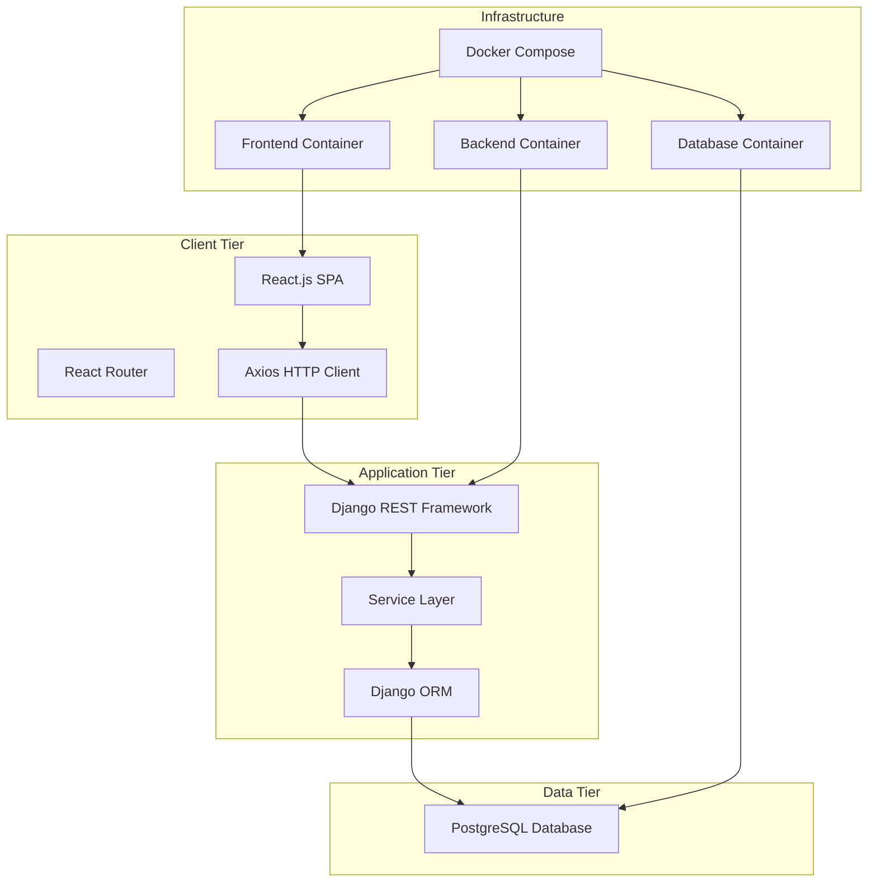

# Design Document

## Overview

The Full-Stack Blog Post Manager follows a modern three-tier architecture with a React.js frontend, Django REST Framework backend, and PostgreSQL database. The system emphasizes separation of concerns, scalability, and maintainability through containerization and clean architecture principles.

## Architecture

### High-Level Architecture



### Technology Stack

**Frontend:**
- React.js 18+ with functional components and hooks
- React Router v6 for client-side routing
- Axios for HTTP requests
- CSS Modules or Styled Components for styling
- Selenium WebDriver for UI testing

**Backend:**
- Django 4.2+ with Django REST Framework
- PostgreSQL adapter (psycopg2)
- Django CORS headers for cross-origin requests
- Python logging module for application logging
- pytest for unit testing

**Database:**
- PostgreSQL 15+ for ACID compliance and scalability
- Connection pooling for performance optimization

**Infrastructure:**
- Docker and Docker Compose for containerization
- Nginx (optional) for production reverse proxy

## Components and Interfaces

### Frontend Components

#### Core Components
```
src/
├── components/
│   ├── common/
│   │   ├── Header.jsx
│   │   ├── Footer.jsx
│   │   ├── LoadingSpinner.jsx
│   │   └── ErrorMessage.jsx
│   ├── posts/
│   │   ├── PostList.jsx
│   │   ├── PostCard.jsx
│   │   ├── PostForm.jsx
│   │   ├── PostDetail.jsx
│   │   └── PostConfirmDelete.jsx
│   └── layout/
│       └── Layout.jsx
├── pages/
│   ├── HomePage.jsx
│   ├── AddPostPage.jsx
│   ├── EditPostPage.jsx
│   ├── ViewPostPage.jsx
│   └── NotFoundPage.jsx
├── services/
│   └── api.js
├── hooks/
│   ├── usePosts.js
│   └── usePost.js
└── utils/
    ├── validation.js
    └── constants.js
```

#### Component Responsibilities

**PostList Component:**
- Fetches and displays all blog posts
- Handles loading and error states
- Provides action buttons for each post

**PostForm Component:**
- Reusable form for creating and editing posts
- Client-side validation
- Handles form submission and API calls

**PostDetail Component:**
- Displays complete post information
- Handles post not found scenarios

#### API Service Layer
```javascript
// services/api.js
class BlogAPI {
  async getAllPosts()
  async getPost(id)
  async createPost(postData)
  async updatePost(id, postData)
  async deletePost(id)
}
```

### Backend Components

#### Django Project Structure
```
backend/
├── blog_manager/
│   ├── settings/
│   │   ├── base.py
│   │   ├── development.py
│   │   └── production.py
│   ├── urls.py
│   └── wsgi.py
├── posts/
│   ├── models.py
│   ├── serializers.py
│   ├── views.py
│   ├── services.py
│   ├── urls.py
│   └── tests/
│       ├── test_models.py
│       ├── test_views.py
│       └── test_services.py
├── common/
│   ├── exceptions.py
│   ├── permissions.py
│   └── pagination.py
└── requirements.txt
```

#### Service Layer Pattern
```python
# posts/services.py
class PostService:
    @staticmethod
    def get_all_posts(page=1, page_size=10):
        """Retrieve paginated posts with business logic"""
        
    @staticmethod
    def get_post_by_id(post_id):
        """Retrieve single post with error handling"""
        
    @staticmethod
    def create_post(validated_data):
        """Create post with business validation"""
        
    @staticmethod
    def update_post(post_id, validated_data):
        """Update post with ownership validation"""
        
    @staticmethod
    def delete_post(post_id):
        """Delete post with cascade handling"""
```

#### API Endpoints Design
```python
# posts/urls.py
urlpatterns = [
    path('api/posts/', PostListCreateView.as_view(), name='post-list-create'),
    path('api/posts/<int:pk>/', PostRetrieveUpdateDestroyView.as_view(), name='post-detail'),
]
```

## Data Models

### Database Schema

#### Post Model
```python
class Post(models.Model):
    id = models.AutoField(primary_key=True)
    title = models.CharField(max_length=200, null=False, blank=False)
    content = models.TextField(null=False, blank=False)
    author = models.CharField(max_length=100, null=False, blank=False)
    tags = models.CharField(max_length=500, blank=True, default='')
    image_url = models.URLField(blank=True, null=True)
    created_at = models.DateTimeField(auto_now_add=True)
    updated_at = models.DateTimeField(auto_now=True)
    
    class Meta:
        ordering = ['-created_at']
        db_table = 'blog_posts'
    
    def __str__(self):
        return self.title
```

#### Database Constraints
- `title`: VARCHAR(200), NOT NULL
- `content`: TEXT, NOT NULL
- `author`: VARCHAR(100), NOT NULL
- `tags`: VARCHAR(500), DEFAULT ''
- `image_url`: VARCHAR(200), NULLABLE
- `created_at`: TIMESTAMP, AUTO
- `updated_at`: TIMESTAMP, AUTO

### API Serializers
```python
class PostSerializer(serializers.ModelSerializer):
    class Meta:
        model = Post
        fields = ['id', 'title', 'content', 'author', 'tags', 'image_url', 'created_at', 'updated_at']
        read_only_fields = ['id', 'created_at', 'updated_at']
    
    def validate_title(self, value):
        if len(value.strip()) < 5:
            raise serializers.ValidationError("Title must be at least 5 characters long")
        return value.strip()
    
    def validate_content(self, value):
        if len(value.strip()) < 10:
            raise serializers.ValidationError("Content must be at least 10 characters long")
        return value.strip()
```

## Error Handling

### Frontend Error Handling

#### Error Boundary Component
```javascript
class ErrorBoundary extends React.Component {
  constructor(props) {
    super(props);
    this.state = { hasError: false, error: null };
  }
  
  static getDerivedStateFromError(error) {
    return { hasError: true, error };
  }
  
  componentDidCatch(error, errorInfo) {
    console.error('Error caught by boundary:', error, errorInfo);
  }
}
```

#### API Error Handling
```javascript
// services/api.js
const handleApiError = (error) => {
  if (error.response) {
    // Server responded with error status
    const { status, data } = error.response;
    switch (status) {
      case 400:
        return { message: 'Invalid data provided', details: data };
      case 404:
        return { message: 'Resource not found' };
      case 500:
        return { message: 'Server error occurred' };
      default:
        return { message: 'An unexpected error occurred' };
    }
  } else if (error.request) {
    // Network error
    return { message: 'Network error - please check your connection' };
  } else {
    return { message: 'An unexpected error occurred' };
  }
};
```

### Backend Error Handling

#### Custom Exception Classes
```python
# common/exceptions.py
class PostNotFoundError(Exception):
    """Raised when a post is not found"""
    pass

class ValidationError(Exception):
    """Raised when data validation fails"""
    pass
```

#### Global Exception Handler
```python
# posts/views.py
from rest_framework.views import exception_handler
from rest_framework.response import Response
import logging

logger = logging.getLogger(__name__)

def custom_exception_handler(exc, context):
    response = exception_handler(exc, context)
    
    if response is not None:
        logger.error(f"API Error: {exc} - Context: {context}")
        
        custom_response_data = {
            'error': True,
            'message': 'An error occurred',
            'details': response.data
        }
        response.data = custom_response_data
    
    return response
```

#### HTTP Status Code Mapping
- **200 OK**: Successful GET, PUT operations
- **201 Created**: Successful POST operations
- **204 No Content**: Successful DELETE operations
- **400 Bad Request**: Validation errors, malformed requests
- **404 Not Found**: Resource not found
- **500 Internal Server Error**: Server-side errors

### Logging Strategy

#### Backend Logging Configuration
```python
# settings/base.py
LOGGING = {
    'version': 1,
    'disable_existing_loggers': False,
    'formatters': {
        'verbose': {
            'format': '{levelname} {asctime} {module} {process:d} {thread:d} {message}',
            'style': '{',
        },
    },
    'handlers': {
        'file': {
            'level': 'INFO',
            'class': 'logging.FileHandler',
            'filename': 'blog_manager.log',
            'formatter': 'verbose',
        },
        'console': {
            'level': 'DEBUG',
            'class': 'logging.StreamHandler',
            'formatter': 'verbose',
        },
    },
    'loggers': {
        'posts': {
            'handlers': ['file', 'console'],
            'level': 'INFO',
            'propagate': True,
        },
    },
}
```

## Testing Strategy

### Frontend Testing

#### Selenium Test Structure
```
tests/
├── selenium/
│   ├── conftest.py
│   ├── test_post_crud.py
│   ├── test_navigation.py
│   └── test_form_validation.py
├── utils/
│   ├── test_helpers.py
│   └── page_objects.py
└── fixtures/
    └── test_data.json
```

#### Page Object Pattern
```python
# tests/utils/page_objects.py
class PostListPage:
    def __init__(self, driver):
        self.driver = driver
    
    def get_post_cards(self):
        return self.driver.find_elements(By.CLASS_NAME, "post-card")
    
    def click_add_post_button(self):
        self.driver.find_element(By.ID, "add-post-btn").click()
    
    def click_edit_post(self, post_id):
        self.driver.find_element(By.ID, f"edit-post-{post_id}").click()
```

#### Test Scenarios
- **CRUD Operations**: Create, read, update, delete posts
- **Form Validation**: Client-side validation messages
- **Navigation**: Router transitions and URL updates
- **Error Handling**: Network errors and API failures

### Backend Testing

#### Unit Test Structure
```python
# posts/tests/test_views.py
class PostViewSetTestCase(APITestCase):
    def setUp(self):
        self.post_data = {
            'title': 'Test Post',
            'content': 'Test content',
            'author': 'Test Author'
        }
    
    def test_create_post_success(self):
        response = self.client.post('/api/posts/', self.post_data)
        self.assertEqual(response.status_code, 201)
        self.assertEqual(Post.objects.count(), 1)
    
    def test_create_post_validation_error(self):
        invalid_data = {'title': '', 'content': 'Test'}
        response = self.client.post('/api/posts/', invalid_data)
        self.assertEqual(response.status_code, 400)
```

#### Test Coverage Areas
- **Model validation**: Field constraints and business rules
- **API endpoints**: All CRUD operations with success/error cases
- **Service layer**: Business logic and data processing
- **Serializers**: Data validation and transformation

### Integration Testing

#### End-to-End Test Flow
1. **User Journey Testing**: Complete workflows from UI to database
2. **API Contract Testing**: Frontend-backend integration
3. **Database Integration**: ORM operations and constraints
4. **Container Integration**: Docker Compose service communication

## Performance Considerations

### Frontend Optimization
- **Code Splitting**: Lazy loading of route components
- **Memoization**: React.memo for expensive components
- **Debouncing**: Search and form input optimization
- **Caching**: API response caching with proper invalidation

### Backend Optimization
- **Database Indexing**: Indexes on frequently queried fields
- **Query Optimization**: Select related and prefetch related
- **Pagination**: Limit result sets for large datasets
- **Connection Pooling**: Efficient database connection management

### Caching Strategy
- **Browser Caching**: Static assets with proper cache headers
- **API Response Caching**: Redis for frequently accessed data
- **Database Query Caching**: Django's built-in query caching

## Security Considerations

### Frontend Security
- **Input Sanitization**: XSS prevention in user content
- **HTTPS Enforcement**: Secure communication protocols
- **Content Security Policy**: Prevent code injection attacks

### Backend Security
- **CORS Configuration**: Proper cross-origin request handling
- **CSRF Protection**: Django's built-in CSRF middleware
- **Input Validation**: Server-side validation for all inputs
- **SQL Injection Prevention**: ORM usage and parameterized queries

### Data Protection
- **Sensitive Data Handling**: No sensitive information in logs
- **Environment Variables**: Configuration through environment
- **Database Security**: Connection encryption and access controls