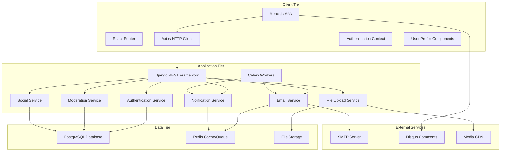

# Design Document

## Overview

The Enhanced FinTalk Platform builds upon the existing Django REST Framework backend and React.js frontend to add comprehensive user management, role-based access control (RBAC), email subscriptions, content moderation, multimedia support, and social features. The design maintains the current three-tier architecture while extending it with new services for authentication, notifications, file management, and social interactions.

## Architecture

### High-Level Architecture



### Enhanced Technology Stack

**Frontend (Existing + New):**
- React.js 18+ with functional components and hooks
- React Router v6 for client-side routing
- Axios for HTTP requests
- **New:** React Context for authentication state
- **New:** React Hook Form for complex forms
- **New:** React Query for server state management
- **New:** Material-UI or Tailwind CSS for enhanced UI
- **New:** React Dropzone for file uploads

**Backend (Existing + New):**
- Django 4.2+ with Django REST Framework
- PostgreSQL adapter (psycopg2)
- Django CORS headers
- **New:** Django Allauth for authentication
- **New:** Django REST Auth for API authentication
- **New:** Celery for background tasks
- **New:** Redis for caching and message broker
- **New:** Pillow for image processing
- **New:** Django Storages for file management
- **New:** Django Email Backend for notifications

**Infrastructure (Existing + New):**
- Docker and Docker Compose
- **New:** Redis container for caching/queues
- **New:** Celery worker containers
- **New:** File storage volume/S3 integration
- **New:** SMTP configuration for email

## Components and Interfaces

### New Database Models

#### User Profile Extension
```python
class UserProfile(models.Model):
    user = models.OneToOneField(User, on_delete=models.CASCADE)
    bio = models.TextField(max_length=500, blank=True)
    avatar = models.ImageField(upload_to='avatars/', blank=True, null=True)
    website = models.URLField(blank=True)
    location = models.CharField(max_length=100, blank=True)
    birth_date = models.DateField(null=True, blank=True)
    is_email_verified = models.BooleanField(default=False)
    email_verification_token = models.CharField(max_length=100, blank=True)
    created_at = models.DateTimeField(auto_now_add=True)
    updated_at = models.DateTimeField(auto_now=True)
```

#### Enhanced Post Model
```python
class Post(models.Model):  # Extending existing model
    # Existing fields remain
    author_user = models.ForeignKey(User, on_delete=models.CASCADE, null=True)  # Link to User
    status = models.CharField(max_length=20, choices=POST_STATUS_CHOICES, default='draft')
    scheduled_publish_date = models.DateTimeField(null=True, blank=True)
    is_featured = models.BooleanField(default=False)
    view_count = models.PositiveIntegerField(default=0)
    like_count = models.PositiveIntegerField(default=0)
    
    class Meta:
        permissions = [
            ('can_moderate_posts', 'Can moderate posts'),
            ('can_schedule_posts', 'Can schedule posts'),
            ('can_feature_posts', 'Can feature posts'),
        ]
```

#### User Roles and Permissions
```python
class Role(models.Model):
    name = models.CharField(max_length=50, unique=True)
    description = models.TextField()
    permissions = models.ManyToManyField('auth.Permission')
    
class UserRole(models.Model):
    user = models.ForeignKey(User, on_delete=models.CASCADE)
    role = models.ForeignKey(Role, on_delete=models.CASCADE)
    assigned_by = models.ForeignKey(User, on_delete=models.SET_NULL, null=True, related_name='assigned_roles')
    assigned_at = models.DateTimeField(auto_now_add=True)
```

#### Email Subscriptions
```python
class EmailSubscription(models.Model):
    user = models.ForeignKey(User, on_delete=models.CASCADE, null=True, blank=True)
    email = models.EmailField()  # For non-registered users
    subscription_type = models.CharField(max_length=50, choices=SUBSCRIPTION_CHOICES)
    is_active = models.BooleanField(default=True)
    unsubscribe_token = models.CharField(max_length=100, unique=True)
    created_at = models.DateTimeField(auto_now_add=True)
```

#### Saved Articles
```python
class SavedArticle(models.Model):
    user = models.ForeignKey(User, on_delete=models.CASCADE)
    post = models.ForeignKey(Post, on_delete=models.CASCADE)
    saved_at = models.DateTimeField(auto_now_add=True)
    
    class Meta:
        unique_together = ['user', 'post']
```

#### Content Moderation
```python
class ContentFlag(models.Model):
    post = models.ForeignKey(Post, on_delete=models.CASCADE)
    flagged_by = models.ForeignKey(User, on_delete=models.CASCADE)
    reason = models.CharField(max_length=100, choices=FLAG_REASON_CHOICES)
    description = models.TextField(blank=True)
    status = models.CharField(max_length=20, choices=FLAG_STATUS_CHOICES, default='pending')
    reviewed_by = models.ForeignKey(User, on_delete=models.SET_NULL, null=True, related_name='reviewed_flags')
    reviewed_at = models.DateTimeField(null=True, blank=True)
    created_at = models.DateTimeField(auto_now_add=True)
```

#### Social Features
```python
class UserFollow(models.Model):
    follower = models.ForeignKey(User, on_delete=models.CASCADE, related_name='following')
    following = models.ForeignKey(User, on_delete=models.CASCADE, related_name='followers')
    created_at = models.DateTimeField(auto_now_add=True)
    
    class Meta:
        unique_together = ['follower', 'following']

class PostLike(models.Model):
    user = models.ForeignKey(User, on_delete=models.CASCADE)
    post = models.ForeignKey(Post, on_delete=models.CASCADE)
    created_at = models.DateTimeField(auto_now_add=True)
    
    class Meta:
        unique_together = ['user', 'post']
```

#### Multimedia Support
```python
class MediaFile(models.Model):
    uploaded_by = models.ForeignKey(User, on_delete=models.CASCADE)
    file = models.FileField(upload_to='media/')
    file_type = models.CharField(max_length=20, choices=MEDIA_TYPE_CHOICES)
    original_name = models.CharField(max_length=255)
    file_size = models.PositiveIntegerField()
    alt_text = models.CharField(max_length=255, blank=True)
    created_at = models.DateTimeField(auto_now_add=True)

class PostMedia(models.Model):
    post = models.ForeignKey(Post, on_delete=models.CASCADE, related_name='media_files')
    media_file = models.ForeignKey(MediaFile, on_delete=models.CASCADE)
    order = models.PositiveIntegerField(default=0)
```

### Enhanced API Endpoints

#### Authentication Endpoints
```python
# accounts/urls.py
urlpatterns = [
    path('api/auth/register/', RegisterView.as_view(), name='register'),
    path('api/auth/login/', LoginView.as_view(), name='login'),
    path('api/auth/logout/', LogoutView.as_view(), name='logout'),
    path('api/auth/verify-email/<str:token>/', VerifyEmailView.as_view(), name='verify-email'),
    path('api/auth/resend-verification/', ResendVerificationView.as_view(), name='resend-verification'),
    path('api/auth/password-reset/', PasswordResetView.as_view(), name='password-reset'),
    path('api/auth/profile/', UserProfileView.as_view(), name='user-profile'),
]
```

#### Enhanced Post Endpoints
```python
# posts/urls.py (extended)
urlpatterns = [
    # Existing endpoints
    path('api/posts/', PostListCreateView.as_view(), name='post-list-create'),
    path('api/posts/<int:pk>/', PostRetrieveUpdateDestroyView.as_view(), name='post-detail'),
    
    # New endpoints
    path('api/posts/<int:pk>/save/', SavePostView.as_view(), name='save-post'),
    path('api/posts/<int:pk>/like/', LikePostView.as_view(), name='like-post'),
    path('api/posts/<int:pk>/flag/', FlagPostView.as_view(), name='flag-post'),
    path('api/posts/<int:pk>/schedule/', SchedulePostView.as_view(), name='schedule-post'),
    path('api/posts/drafts/', DraftPostsView.as_view(), name='draft-posts'),
    path('api/posts/saved/', SavedPostsView.as_view(), name='saved-posts'),
    path('api/posts/<int:pk>/media/', PostMediaView.as_view(), name='post-media'),
]
```

#### Social and Moderation Endpoints
```python
# social/urls.py
urlpatterns = [
    path('api/users/<int:pk>/follow/', FollowUserView.as_view(), name='follow-user'),
    path('api/users/<int:pk>/followers/', UserFollowersView.as_view(), name='user-followers'),
    path('api/users/<int:pk>/following/', UserFollowingView.as_view(), name='user-following'),
    path('api/subscriptions/', EmailSubscriptionView.as_view(), name='email-subscription'),
    path('api/unsubscribe/<str:token>/', UnsubscribeView.as_view(), name='unsubscribe'),
]

# moderation/urls.py
urlpatterns = [
    path('api/moderation/flags/', ContentFlagListView.as_view(), name='content-flags'),
    path('api/moderation/flags/<int:pk>/', ContentFlagDetailView.as_view(), name='flag-detail'),
    path('api/moderation/users/', UserModerationView.as_view(), name='user-moderation'),
]
```

### Service Layer Architecture

#### Authentication Service
```python
class AuthenticationService:
    @staticmethod
    def register_user(email, password, **profile_data):
        """Register user and send verification email"""
        
    @staticmethod
    def verify_email(token):
        """Verify user email with token"""
        
    @staticmethod
    def assign_role(user, role_name, assigned_by):
        """Assign role to user with permission checks"""
        
    @staticmethod
    def check_permission(user, permission):
        """Check if user has specific permission"""
```

#### Email Notification Service
```python
class EmailNotificationService:
    @staticmethod
    def send_verification_email(user):
        """Send email verification"""
        
    @staticmethod
    def send_new_post_notifications(post):
        """Queue notifications for new post"""
        
    @staticmethod
    def send_follow_notification(follower, following):
        """Notify user of new follower"""
        
    @staticmethod
    def send_moderation_alert(flag):
        """Alert moderators of flagged content"""
```

#### File Management Service
```python
class FileManagementService:
    @staticmethod
    def upload_media(file, user, alt_text=None):
        """Upload and process media file"""
        
    @staticmethod
    def validate_file(file):
        """Validate file type and size"""
        
    @staticmethod
    def generate_thumbnails(image_file):
        """Generate image thumbnails"""
        
    @staticmethod
    def attach_media_to_post(post, media_files):
        """Associate media files with post"""
```

### Frontend Component Architecture

#### Authentication Components
```
src/components/auth/
├── LoginForm.jsx
├── RegisterForm.jsx
├── EmailVerification.jsx
├── PasswordReset.jsx
├── UserProfile.jsx
└── ProtectedRoute.jsx
```

#### Enhanced Post Components
```
src/components/posts/
├── PostEditor.jsx (enhanced with media upload)
├── DraftsList.jsx
├── SchedulePost.jsx
├── PostActions.jsx (save, like, flag)
├── MediaUpload.jsx
└── PostMedia.jsx
```

#### Social Components
```
src/components/social/
├── UserProfile.jsx
├── FollowButton.jsx
├── FollowersList.jsx
├── SavedPosts.jsx
└── EmailSubscription.jsx
```

#### Moderation Components
```
src/components/moderation/
├── FlagContent.jsx
├── ModerationPanel.jsx
├── FlagsList.jsx
└── UserManagement.jsx
```

## Data Models

### User Management Schema

#### Extended User Model
The existing Django User model will be extended with UserProfile for additional information and UserRole for RBAC implementation.

#### Role-Based Access Control
```sql
-- Roles table
CREATE TABLE roles (
    id SERIAL PRIMARY KEY,
    name VARCHAR(50) UNIQUE NOT NULL,
    description TEXT,
    created_at TIMESTAMP DEFAULT NOW()
);

-- User roles junction table
CREATE TABLE user_roles (
    id SERIAL PRIMARY KEY,
    user_id INTEGER REFERENCES auth_user(id),
    role_id INTEGER REFERENCES roles(id),
    assigned_by INTEGER REFERENCES auth_user(id),
    assigned_at TIMESTAMP DEFAULT NOW(),
    UNIQUE(user_id, role_id)
);
```

### Content Management Schema

#### Enhanced Posts
The existing Post model will be extended with new fields for status, scheduling, and social features while maintaining backward compatibility.

#### Media Management
```sql
-- Media files table
CREATE TABLE media_files (
    id SERIAL PRIMARY KEY,
    uploaded_by INTEGER REFERENCES auth_user(id),
    file VARCHAR(255) NOT NULL,
    file_type VARCHAR(20) NOT NULL,
    original_name VARCHAR(255),
    file_size INTEGER,
    alt_text VARCHAR(255),
    created_at TIMESTAMP DEFAULT NOW()
);

-- Post media junction table
CREATE TABLE post_media (
    id SERIAL PRIMARY KEY,
    post_id INTEGER REFERENCES blog_posts(id),
    media_file_id INTEGER REFERENCES media_files(id),
    order_index INTEGER DEFAULT 0
);
```

### Social Features Schema

#### User Relationships
```sql
-- User follows table
CREATE TABLE user_follows (
    id SERIAL PRIMARY KEY,
    follower_id INTEGER REFERENCES auth_user(id),
    following_id INTEGER REFERENCES auth_user(id),
    created_at TIMESTAMP DEFAULT NOW(),
    UNIQUE(follower_id, following_id)
);

-- Saved articles table
CREATE TABLE saved_articles (
    id SERIAL PRIMARY KEY,
    user_id INTEGER REFERENCES auth_user(id),
    post_id INTEGER REFERENCES blog_posts(id),
    saved_at TIMESTAMP DEFAULT NOW(),
    UNIQUE(user_id, post_id)
);
```

## Error Handling

### Enhanced Authentication Errors
```python
class AuthenticationErrorHandler:
    @staticmethod
    def handle_registration_error(error):
        """Handle user registration errors"""
        
    @staticmethod
    def handle_verification_error(error):
        """Handle email verification errors"""
        
    @staticmethod
    def handle_permission_error(error):
        """Handle permission denied errors"""
```

### File Upload Error Handling
```python
class FileUploadErrorHandler:
    @staticmethod
    def handle_file_size_error(file_size, max_size):
        """Handle file size exceeded errors"""
        
    @staticmethod
    def handle_file_type_error(file_type, allowed_types):
        """Handle invalid file type errors"""
        
    @staticmethod
    def handle_storage_error(error):
        """Handle file storage errors"""
```

### Social Features Error Handling
```python
class SocialErrorHandler:
    @staticmethod
    def handle_follow_error(error):
        """Handle user follow/unfollow errors"""
        
    @staticmethod
    def handle_duplicate_action_error(action):
        """Handle duplicate actions (like, save, flag)"""
```

## Testing Strategy

### Authentication Testing
```python
class AuthenticationTestCase(APITestCase):
    def test_user_registration_with_email_verification(self):
        """Test complete registration flow"""
        
    def test_role_assignment_permissions(self):
        """Test RBAC functionality"""
        
    def test_email_verification_flow(self):
        """Test email verification process"""
```

### Social Features Testing
```python
class SocialFeaturesTestCase(APITestCase):
    def test_user_follow_unfollow(self):
        """Test follow/unfollow functionality"""
        
    def test_post_save_unsave(self):
        """Test save/unsave posts"""
        
    def test_email_subscription_flow(self):
        """Test email subscription and notifications"""
```

### File Upload Testing
```python
class FileUploadTestCase(APITestCase):
    def test_image_upload_and_processing(self):
        """Test image upload and thumbnail generation"""
        
    def test_file_validation(self):
        """Test file type and size validation"""
        
    def test_media_attachment_to_posts(self):
        """Test attaching media to posts"""
```

## Security Considerations

### Enhanced Authentication Security
- **Email Verification**: Mandatory email verification for new accounts
- **Password Policies**: Strong password requirements with validation
- **Session Management**: Secure session handling with proper timeouts
- **Rate Limiting**: API rate limiting for authentication endpoints

### File Upload Security
- **File Type Validation**: Strict file type checking and MIME validation
- **File Size Limits**: Configurable file size limits per user role
- **Virus Scanning**: Integration with antivirus scanning for uploads
- **Secure Storage**: Secure file storage with proper access controls

### Content Moderation Security
- **Input Sanitization**: Enhanced HTML sanitization for rich content
- **Spam Prevention**: Rate limiting and content analysis for spam
- **Automated Moderation**: Basic automated flagging for inappropriate content
- **Audit Logging**: Comprehensive logging of moderation actions

## Performance Considerations

### Caching Strategy
- **Redis Integration**: Redis for session storage and caching
- **Query Optimization**: Database query optimization for social features
- **Media CDN**: Content delivery network for media files
- **Background Processing**: Celery for email notifications and heavy tasks

### Database Optimization
- **Indexing Strategy**: Proper indexing for new tables and queries
- **Connection Pooling**: Database connection pooling for scalability
- **Query Monitoring**: Database query performance monitoring
- **Data Archiving**: Strategy for archiving old data

### Scalability Considerations
- **Horizontal Scaling**: Support for multiple application instances
- **Load Balancing**: Load balancer configuration for high availability
- **Microservices Ready**: Architecture prepared for microservices migration
- **Monitoring**: Comprehensive application and infrastructure monitoring

## Integration Points

### Celery Task Queue
```python
# tasks.py
@shared_task
def send_new_post_notification(post_id):
    """Background task for sending post notifications"""
    
@shared_task
def process_uploaded_media(media_file_id):
    """Background task for media processing"""
    
@shared_task
def publish_scheduled_post(post_id):
    """Background task for scheduled publishing"""
```

### Email Service Integration
```python
# email_service.py
class EmailService:
    def __init__(self):
        self.smtp_backend = get_connection()
    
    def send_template_email(self, template, context, recipients):
        """Send templated email to recipients"""
        
    def send_bulk_notifications(self, post, subscribers):
        """Send bulk notifications for new posts"""
```

### Disqus Integration
```javascript
// DisqusComments.jsx
const DisqusComments = ({ postId, postTitle, postUrl }) => {
  useEffect(() => {
    // Initialize Disqus
    window.disqus_config = function () {
      this.page.url = postUrl;
      this.page.identifier = postId;
      this.page.title = postTitle;
    };
  }, [postId, postTitle, postUrl]);
  
  return <div id="disqus_thread"></div>;
};
```

This design maintains compatibility with the existing FinTalk system while adding comprehensive new features for user management, social interaction, and content moderation.