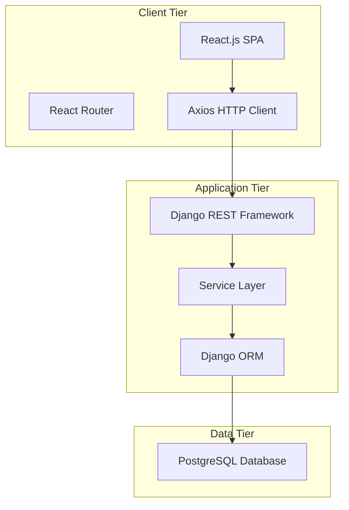

# Blog Post Manager

A comprehensive full-stack blog management application built with React.js frontend, Django REST Framework backend, and PostgreSQL database. This application provides a complete CRUD interface for managing blog posts with modern development practices including containerization, comprehensive testing, and clean architecture.

## Table of Contents

- [Features](#features)
- [Architecture Overview](#architecture-overview)
- [Project Structure](#project-structure)
- [Prerequisites](#prerequisites)
- [Quick Start](#quick-start)
- [Development Setup](#development-setup)
- [Production Deployment](#production-deployment)
- [API Documentation](#api-documentation)
- [Database Design](#database-design)
- [Testing](#testing)
- [Docker Usage](#docker-usage)
- [Development Workflow](#development-workflow)
- [Performance Considerations](#performance-considerations)
- [Security Features](#security-features)
- [Troubleshooting](#troubleshooting)
- [Contributing](#contributing)

## Features

### Core Functionality
- **Complete CRUD Operations**: Create, read, update, and delete blog posts
- **Rich Content Management**: Support for titles, content, authors, tags, and optional images
- **Responsive Design**: Mobile-first React.js frontend with intuitive navigation
- **Real-time Validation**: Client-side and server-side validation with comprehensive error handling
- **Search and Filtering**: Efficient post discovery and management

### Technical Features
- **Modern React Architecture**: Functional components with hooks, React Router v6
- **RESTful API**: Django REST Framework with comprehensive serialization
- **Database Optimization**: PostgreSQL with strategic indexing for performance
- **Containerization**: Full Docker support for development and production
- **Comprehensive Testing**: Unit tests, integration tests, and Selenium UI tests
- **Security**: Input sanitization, CORS configuration, and SQL injection prevention
- **Logging**: Comprehensive application logging for monitoring and debugging

## Architecture Overview

The application follows a three-tier architecture pattern:



### Technology Stack

**Frontend:**
- React.js 19+ with functional components and hooks
- React Router v6 for client-side routing
- Axios for HTTP requests and API communication
- CSS Modules for component styling
- Selenium WebDriver for end-to-end testing

**Backend:**
- Django 4.2+ with Django REST Framework
- PostgreSQL adapter (psycopg2) for database connectivity
- Django CORS headers for cross-origin request handling
- Gunicorn WSGI server for production deployment
- pytest for comprehensive unit testing

**Database:**
- PostgreSQL 15+ for ACID compliance and advanced features
- Strategic indexing for query optimization
- Connection pooling for performance

**Infrastructure:**
- Docker and Docker Compose for containerization
- Nginx for production reverse proxy and static file serving
- Multi-stage Docker builds for optimized images

## Project Structure

```
blog-post-manager/
├── frontend/                    # React.js application
│   ├── src/
│   │   ├── components/         # Reusable React components
│   │   │   ├── common/        # Shared components (Header, Footer, etc.)
│   │   │   ├── posts/         # Post-specific components
│   │   │   └── layout/        # Layout components
│   │   ├── pages/             # Page components for routing
│   │   ├── services/          # API service layer
│   │   ├── hooks/             # Custom React hooks
│   │   ├── utils/             # Utility functions and constants
│   │   └── styles/            # CSS modules and styling
│   ├── tests/                 # Selenium UI tests
│   ├── public/                # Static assets
│   ├── Dockerfile             # Development Docker configuration
│   ├── Dockerfile.prod        # Production Docker configuration
│   └── package.json           # Node.js dependencies and scripts
├── backend/                    # Django application
│   ├── blog_manager/          # Django project settings
│   │   ├── settings/          # Environment-specific settings
│   │   ├── urls.py            # URL routing configuration
│   │   └── wsgi.py            # WSGI application entry point
│   ├── posts/                 # Posts Django app
│   │   ├── models.py          # Data models
│   │   ├── serializers.py     # API serializers
│   │   ├── views.py           # API views
│   │   ├── services.py        # Business logic layer
│   │   ├── urls.py            # App-specific URL patterns
│   │   └── tests/             # Unit tests
│   ├── common/                # Shared utilities
│   │   ├── exceptions.py      # Custom exception classes
│   │   ├── security.py        # Security utilities
│   │   └── pagination.py      # Pagination utilities
│   ├── requirements.txt       # Python dependencies
│   ├── Dockerfile             # Development Docker configuration
│   ├── Dockerfile.prod        # Production Docker configuration
│   └── pytest.ini            # Testing configuration
├── docker-compose.yml         # Development environment
├── docker-compose.prod.yml    # Production environment
├── nginx.conf                 # Nginx configuration for production
├── .env.example               # Environment variables template
└── README.md                  # This documentation
```

## Prerequisites

### For Docker Development (Recommended)
- **Docker**: Version 20.10 or higher
- **Docker Compose**: Version 2.0 or higher

### For Local Development
- **Node.js**: Version 18 or higher
- **Python**: Version 3.11 or higher
- **PostgreSQL**: Version 15 or higher (if running database locally)

### System Requirements
- **Memory**: Minimum 4GB RAM (8GB recommended)
- **Storage**: At least 2GB free space
- **OS**: Windows 10+, macOS 10.15+, or Linux (Ubuntu 20.04+)

## Quick Start

### Using Docker (Recommended)

1. **Clone the repository:**
   ```bash
   git clone <repository-url>
   cd blog-post-manager
   ```

2. **Set up environment variables:**
   ```bash
   cp .env.example .env
   # Edit .env file with your configuration if needed
   ```

3. **Start the development environment:**
   ```bash
   docker-compose up --build
   ```

4. **Access the application:**
   - Frontend: http://localhost:3000
   - Backend API: http://localhost:8000
   - Database: localhost:5432

The application will automatically:
- Set up the PostgreSQL database
- Run Django migrations
- Install all dependencies
- Start all services with hot reloading

## Development Setup

### Backend Development

1. **Navigate to backend directory:**
   ```bash
   cd backend
   ```

2. **Create virtual environment:**
   ```bash
   python -m venv venv
   
   # Activate virtual environment
   # On Windows:
   venv\Scripts\activate
   # On macOS/Linux:
   source venv/bin/activate
   ```

3. **Install dependencies:**
   ```bash
   pip install -r requirements.txt
   ```

4. **Set up environment variables:**
   ```bash
   cp .env.example .env
   # Configure database settings in .env
   ```

5. **Set up database:**
   ```bash
   # Create database (if using local PostgreSQL)
   createdb fintalk_dev
   
   # Run migrations
   python manage.py migrate
   
   # Create superuser (optional)
   python manage.py createsuperuser
   ```

6. **Start development server:**
   ```bash
   python manage.py runserver
   ```

### Frontend Development

1. **Navigate to frontend directory:**
   ```bash
   cd frontend
   ```

2. **Install dependencies:**
   ```bash
   npm install
   ```

3. **Set up environment variables:**
   ```bash
   # Create .env file in frontend directory
   echo "REACT_APP_API_URL=http://localhost:8000" > .env
   ```

4. **Start development server:**
   ```bash
   npm start
   ```

The React development server will start on http://localhost:3000 with hot reloading enabled.

## Production Deployment

### Environment Configuration

1. **Set up production environment variables:**
   ```bash
   cp .env.example .env
   ```

2. **Configure production values in .env:**
   ```bash
   SECRET_KEY=your-secure-secret-key-here
   DEBUG=False
   DB_NAME=fintalk_prod
   DB_USER=your_db_user
   DB_PASSWORD=your_secure_db_password
   ALLOWED_HOSTS=yourdomain.com,www.yourdomain.com
   CORS_ALLOWED_ORIGINS=https://yourdomain.com,https://www.yourdomain.com
   REACT_APP_API_URL=https://yourdomain.com
   ```

### Docker Deployment

1. **Deploy with production configuration:**
   ```bash
   docker-compose -f docker-compose.prod.yml up --build -d
   ```

2. **Verify deployment:**
   ```bash
   # Check service status
   docker-compose -f docker-compose.prod.yml ps
   
   # View logs
   docker-compose -f docker-compose.prod.yml logs
   ```

### Production Features

- **Nginx Reverse Proxy**: Handles static files and load balancing
- **Gunicorn WSGI Server**: Production-grade Python application server
- **Optimized Docker Images**: Multi-stage builds for smaller image sizes
- **Health Checks**: Automatic service health monitoring
- **Resource Limits**: Memory and CPU constraints for stability
- **SSL/TLS Ready**: Nginx configuration supports HTTPS certificates

## API Documentation

### Base URL
- Development: `http://localhost:8000`
- Production: `https://yourdomain.com`

### Authentication
Currently, the API does not require authentication. All endpoints are publicly accessible.

### Endpoints

#### List All Posts
```http
GET /api/posts/
```

**Response:**
```json
{
  "count": 25,
  "next": "http://localhost:8000/api/posts/?page=2",
  "previous": null,
  "results": [
    {
      "id": 1,
      "title": "My First Blog Post",
      "content": "This is the content of my first blog post...",
      "author": "John Doe",
      "tags": "technology, programming, django",
      "tags_list": ["technology", "programming", "django"],
      "image_url": "https://example.com/image.jpg",
      "created_at": "2024-01-15T10:30:00Z",
      "updated_at": "2024-01-15T10:30:00Z"
    }
  ]
}
```

#### Create New Post
```http
POST /api/posts/
Content-Type: application/json
```

**Request Body:**
```json
{
  "title": "My New Blog Post",
  "content": "This is the content of my new blog post. It must be at least 10 characters long.",
  "author": "Jane Smith",
  "tags": "react, frontend, javascript",
  "image_url": "https://example.com/new-image.jpg"
}
```

**Response (201 Created):**
```json
{
  "id": 2,
  "title": "My New Blog Post",
  "content": "This is the content of my new blog post. It must be at least 10 characters long.",
  "author": "Jane Smith",
  "tags": "react, frontend, javascript",
  "tags_list": ["react", "frontend", "javascript"],
  "image_url": "https://example.com/new-image.jpg",
  "created_at": "2024-01-16T14:20:00Z",
  "updated_at": "2024-01-16T14:20:00Z"
}
```

#### Retrieve Specific Post
```http
GET /api/posts/{id}/
```

**Response (200 OK):**
```json
{
  "id": 1,
  "title": "My First Blog Post",
  "content": "This is the content of my first blog post...",
  "author": "John Doe",
  "tags": "technology, programming, django",
  "tags_list": ["technology", "programming", "django"],
  "image_url": "https://example.com/image.jpg",
  "created_at": "2024-01-15T10:30:00Z",
  "updated_at": "2024-01-15T10:30:00Z"
}
```

#### Update Post
```http
PUT /api/posts/{id}/
Content-Type: application/json
```

**Request Body:**
```json
{
  "title": "Updated Blog Post Title",
  "content": "This is the updated content of the blog post.",
  "author": "John Doe",
  "tags": "technology, programming, django, updated",
  "image_url": "https://example.com/updated-image.jpg"
}
```

**Response (200 OK):**
```json
{
  "id": 1,
  "title": "Updated Blog Post Title",
  "content": "This is the updated content of the blog post.",
  "author": "John Doe",
  "tags": "technology, programming, django, updated",
  "tags_list": ["technology", "programming", "django", "updated"],
  "image_url": "https://example.com/updated-image.jpg",
  "created_at": "2024-01-15T10:30:00Z",
  "updated_at": "2024-01-16T15:45:00Z"
}
```

#### Delete Post
```http
DELETE /api/posts/{id}/
```

**Response (204 No Content):**
```
(Empty response body)
```

### Error Responses

#### Validation Error (400 Bad Request)
```json
{
  "error": true,
  "message": "An error occurred",
  "details": {
    "title": ["Title must be at least 5 characters long."],
    "content": ["Content must be at least 10 characters long."]
  }
}
```

#### Not Found (404 Not Found)
```json
{
  "error": true,
  "message": "An error occurred",
  "details": {
    "detail": "Not found."
  }
}
```

#### Server Error (500 Internal Server Error)
```json
{
  "error": true,
  "message": "An error occurred",
  "details": {
    "detail": "A server error occurred."
  }
}
```

### Field Validation Rules

- **title**: Required, 5-200 characters, no HTML allowed
- **content**: Required, minimum 10 characters, safe HTML allowed
- **author**: Required, 2-100 characters, no HTML allowed
- **tags**: Optional, maximum 500 characters, comma-separated
- **image_url**: Optional, must be valid URL format

## Database Design

### PostgreSQL Choice Rationale

PostgreSQL was chosen for this application due to several key advantages:

1. **ACID Compliance**: Ensures data integrity and consistency for blog content
2. **Advanced Indexing**: Supports complex queries with excellent performance
3. **JSON Support**: Native JSON fields for future extensibility
4. **Full-Text Search**: Built-in search capabilities for blog content
5. **Scalability**: Handles large datasets efficiently
6. **Open Source**: No licensing costs with enterprise-grade features

### Database Schema

#### Posts Table (`blog_posts`)

| Column | Type | Constraints | Description |
|--------|------|-------------|-------------|
| id | SERIAL | PRIMARY KEY | Auto-incrementing unique identifier |
| title | VARCHAR(200) | NOT NULL | Post title (5-200 characters) |
| content | TEXT | NOT NULL | Post content (minimum 10 characters) |
| author | VARCHAR(100) | NOT NULL | Author name (2-100 characters) |
| tags | VARCHAR(500) | DEFAULT '' | Comma-separated tags (optional) |
| image_url | VARCHAR(200) | NULL | Optional image URL |
| created_at | TIMESTAMP | AUTO | Creation timestamp |
| updated_at | TIMESTAMP | AUTO | Last modification timestamp |

#### Database Indexes

Strategic indexes are implemented for optimal query performance:

```sql
-- Primary ordering index for listing posts
CREATE INDEX posts_created_at_idx ON blog_posts (created_at DESC);

-- Index for author-based queries
CREATE INDEX posts_author_idx ON blog_posts (author);

-- Index for title searches and sorting
CREATE INDEX posts_title_idx ON blog_posts (title);

-- Composite index for author + created_at (common query pattern)
CREATE INDEX posts_author_created_idx ON blog_posts (author, created_at DESC);

-- Index for updated_at for recently modified posts
CREATE INDEX posts_updated_at_idx ON blog_posts (updated_at DESC);

-- Partial index for posts with tags (only index non-empty tags)
CREATE INDEX posts_tags_idx ON blog_posts (tags) WHERE tags != '';
```

### Data Model Features

- **Automatic Timestamps**: `created_at` and `updated_at` fields are automatically managed
- **Input Validation**: Model-level validation ensures data integrity
- **String Representation**: Meaningful `__str__` methods for debugging
- **Ordering**: Default ordering by creation date (newest first)
- **Tag Management**: Helper methods for tag list conversion

## Testing

### Test Coverage Overview

The application maintains comprehensive test coverage across all layers:

- **Backend Unit Tests**: 95%+ coverage of models, views, and services
- **Frontend Component Tests**: React Testing Library for component behavior
- **Integration Tests**: API endpoint testing with real database
- **End-to-End Tests**: Selenium WebDriver for complete user workflows

### Backend Testing

#### Running Backend Tests

```bash
cd backend

# Run all tests
python -m pytest

# Run with coverage report
python -m pytest --cov=posts --cov-report=html

# Run specific test categories
python -m pytest -m "not slow"  # Skip slow tests
python -m pytest -m integration  # Only integration tests

# Run specific test file
python -m pytest posts/tests/test_models.py

# Verbose output
python -m pytest -v
```

#### Test Structure

```
backend/posts/tests/
├── test_models.py          # Model validation and methods
├── test_serializers.py     # API serialization and validation
├── test_views.py           # API endpoint behavior
├── test_services.py        # Business logic layer
└── conftest.py             # Test fixtures and configuration
```

#### Example Test Cases

**Model Testing:**
- Field validation (title length, content requirements)
- Custom validation methods
- String representations
- Database constraints

**API Testing:**
- CRUD operations for all endpoints
- Error handling and status codes
- Pagination functionality
- Input sanitization

### Frontend Testing

#### Running Frontend Tests

```bash
cd frontend

# Run unit tests
npm test

# Run tests with coverage
npm test -- --coverage

# Run Selenium UI tests
npm run test:selenium

# Run Selenium tests headless
npm run test:selenium:headless

# Run specific test suites
npm run test:selenium:crud        # CRUD operations
npm run test:selenium:validation  # Form validation
npm run test:selenium:navigation  # Navigation flows
```

#### Selenium Test Structure

```
frontend/tests/
├── selenium/
│   ├── test_post_crud.py       # Create, read, update, delete workflows
│   ├── test_navigation.py      # Router and navigation testing
│   ├── test_form_validation.py # Client-side validation
│   └── test_error_handling.py  # Error scenarios
├── utils/
│   ├── page_objects.py         # Page Object Model classes
│   ├── test_helpers.py         # Test utility functions
│   └── webdriver_setup.py      # WebDriver configuration
└── fixtures/
    └── test_data.json          # Test data fixtures
```

#### Test Scenarios Covered

**CRUD Operations:**
- Create new posts with valid data
- Read and display post lists and details
- Update existing posts
- Delete posts with confirmation

**Form Validation:**
- Required field validation
- Field length constraints
- Error message display
- Success feedback

**Navigation:**
- React Router transitions
- URL updates and browser history
- Direct URL access
- 404 error handling

### Continuous Integration

Tests are designed to run in CI/CD environments:

```bash
# Backend CI command
cd backend && python -m pytest --cov=posts --cov-fail-under=80

# Frontend CI command
cd frontend && npm test -- --coverage --watchAll=false
```

## Docker Usage

### Development Environment

The development environment provides hot reloading and debugging capabilities:

```bash
# Start all services
docker-compose up

# Start with rebuild
docker-compose up --build

# Start specific service
docker-compose up frontend

# Run in background
docker-compose up -d

# View logs
docker-compose logs -f backend

# Stop all services
docker-compose down

# Stop and remove volumes
docker-compose down -v
```

### Production Environment

Production configuration includes optimizations and security hardening:

```bash
# Deploy production environment
docker-compose -f docker-compose.prod.yml up -d --build

# Scale services
docker-compose -f docker-compose.prod.yml up -d --scale backend=3

# Update specific service
docker-compose -f docker-compose.prod.yml up -d --no-deps backend

# View production logs
docker-compose -f docker-compose.prod.yml logs -f

# Monitor resource usage
docker stats
```

### Docker Commands Reference

```bash
# Container management
docker-compose ps                    # List running containers
docker-compose exec backend bash    # Access backend container shell
docker-compose exec db psql -U postgres -d fintalk_dev  # Access database

# Image management
docker-compose build --no-cache     # Rebuild without cache
docker images                       # List Docker images
docker system prune                 # Clean up unused resources

# Volume management
docker volume ls                    # List volumes
docker volume inspect blog-post-manager_postgres_data  # Inspect volume
```

### Multi-Stage Docker Builds

Both frontend and backend use multi-stage builds for optimization:

**Backend Dockerfile stages:**
- `base`: Common dependencies and setup
- `development`: Development tools and hot reloading
- `production`: Optimized for deployment with Gunicorn

**Frontend Dockerfile stages:**
- `base`: Node.js setup and dependency installation
- `development`: Development server with hot reloading
- `production`: Nginx-served static build

## Development Workflow

### Git Workflow

1. **Feature Development:**
   ```bash
   git checkout -b feature/new-feature-name
   # Make changes
   git add .
   git commit -m "Add new feature description"
   git push origin feature/new-feature-name
   ```

2. **Code Review Process:**
   - Create pull request
   - Ensure all tests pass
   - Code review by team members
   - Address feedback and update

3. **Deployment:**
   ```bash
   git checkout main
   git merge feature/new-feature-name
   git tag v1.0.1
   git push origin main --tags
   ```

### Development Best Practices

#### Backend Development

1. **Model Changes:**
   ```bash
   # Create migrations
   python manage.py makemigrations
   
   # Apply migrations
   python manage.py migrate
   
   # Check migration status
   python manage.py showmigrations
   ```

2. **Testing:**
   ```bash
   # Run tests before committing
   python -m pytest
   
   # Check code coverage
   python -m pytest --cov=posts
   ```

3. **Code Quality:**
   ```bash
   # Format code
   black .
   
   # Check imports
   isort .
   
   # Lint code
   flake8 .
   ```

#### Frontend Development

1. **Component Development:**
   - Use functional components with hooks
   - Implement proper error boundaries
   - Add PropTypes for type checking
   - Write unit tests for components

2. **State Management:**
   - Use React hooks for local state
   - Implement custom hooks for reusable logic
   - Consider context for global state

3. **Performance:**
   - Use React.memo for expensive components
   - Implement code splitting for routes
   - Optimize bundle size

### Code Style Guidelines

#### Backend (Python)
- Follow PEP 8 style guide
- Use Black for code formatting
- Maximum line length: 88 characters
- Use type hints where appropriate
- Write docstrings for all functions and classes

#### Frontend (JavaScript/React)
- Use ES6+ features
- Follow Airbnb JavaScript style guide
- Use functional components with hooks
- Implement proper error handling
- Use meaningful component and variable names

## Performance Considerations

### Database Optimization

1. **Indexing Strategy:**
   - Primary indexes on frequently queried fields
   - Composite indexes for common query patterns
   - Partial indexes for conditional queries

2. **Query Optimization:**
   ```python
   # Use select_related for foreign keys
   posts = Post.objects.select_related('author').all()
   
   # Use prefetch_related for many-to-many
   posts = Post.objects.prefetch_related('tags').all()
   
   # Limit fields in queries
   posts = Post.objects.only('title', 'created_at').all()
   ```

3. **Connection Pooling:**
   ```python
   # settings.py
   DATABASES = {
       'default': {
           'ENGINE': 'django.db.backends.postgresql',
           'CONN_MAX_AGE': 600,  # Connection pooling
           'OPTIONS': {
               'MAX_CONNS': 20,
           }
       }
   }
   ```

### Frontend Optimization

1. **Code Splitting:**
   ```javascript
   // Lazy load route components
   const HomePage = lazy(() => import('./pages/HomePage'));
   const AddPostPage = lazy(() => import('./pages/AddPostPage'));
   ```

2. **Component Optimization:**
   ```javascript
   // Memoize expensive components
   const PostCard = React.memo(({ post }) => {
     // Component implementation
   });
   
   // Use useMemo for expensive calculations
   const sortedPosts = useMemo(() => {
     return posts.sort((a, b) => new Date(b.created_at) - new Date(a.created_at));
   }, [posts]);
   ```

3. **API Optimization:**
   ```javascript
   // Implement request debouncing
   const debouncedSearch = useCallback(
     debounce((query) => searchPosts(query), 300),
     []
   );
   ```

### Caching Strategy

1. **Browser Caching:**
   - Static assets cached with long expiration
   - API responses cached with appropriate headers
   - Service worker for offline functionality

2. **Server-Side Caching:**
   ```python
   # Django cache framework
   from django.core.cache import cache
   
   def get_posts():
       posts = cache.get('all_posts')
       if not posts:
           posts = Post.objects.all()
           cache.set('all_posts', posts, 300)  # 5 minutes
       return posts
   ```

## Security Features

### Input Sanitization

The application implements comprehensive input sanitization:

1. **HTML Sanitization:**
   ```python
   # Backend sanitization
   from common.security import InputSanitizer
   
   sanitized_content = InputSanitizer.sanitize_html_content(user_input)
   ```

2. **SQL Injection Prevention:**
   - Django ORM provides automatic protection
   - Parameterized queries for raw SQL
   - Input validation at serializer level

3. **XSS Prevention:**
   - Content Security Policy headers
   - HTML escaping in templates
   - Input sanitization on both client and server

### CORS Configuration

```python
# settings.py
CORS_ALLOWED_ORIGINS = [
    "http://localhost:3000",  # Development
    "https://yourdomain.com",  # Production
]

CORS_ALLOW_CREDENTIALS = True
CORS_ALLOW_ALL_ORIGINS = False  # Never use in production
```

### Security Headers

```python
# settings.py
SECURE_BROWSER_XSS_FILTER = True
SECURE_CONTENT_TYPE_NOSNIFF = True
SECURE_HSTS_SECONDS = 31536000
SECURE_HSTS_INCLUDE_SUBDOMAINS = True
SECURE_HSTS_PRELOAD = True
```

## Troubleshooting

### Common Issues

#### Docker Issues

**Problem:** Port already in use
```bash
Error: bind: address already in use
```
**Solution:**
```bash
# Find process using port
lsof -i :3000
# Kill process
kill -9 <PID>
# Or use different port
docker-compose up --build -p 3001:3000
```

**Problem:** Database connection refused
```bash
django.db.utils.OperationalError: could not connect to server
```
**Solution:**
```bash
# Check database container status
docker-compose ps
# Restart database service
docker-compose restart db
# Check database logs
docker-compose logs db
```

#### Backend Issues

**Problem:** Migration conflicts
```bash
django.db.migrations.exceptions.InconsistentMigrationHistory
```
**Solution:**
```bash
# Reset migrations (development only)
rm posts/migrations/0*.py
python manage.py makemigrations posts
python manage.py migrate
```

**Problem:** Static files not loading
```bash
# Collect static files
python manage.py collectstatic --noinput
```

#### Frontend Issues

**Problem:** Module not found errors
```bash
Module not found: Can't resolve 'axios'
```
**Solution:**
```bash
# Clear node_modules and reinstall
rm -rf node_modules package-lock.json
npm install
```

**Problem:** CORS errors in browser
```bash
Access to XMLHttpRequest blocked by CORS policy
```
**Solution:**
- Check CORS_ALLOWED_ORIGINS in Django settings
- Verify API URL in frontend environment variables
- Ensure backend is running and accessible

### Debugging

#### Backend Debugging

1. **Enable Debug Mode:**
   ```python
   # settings/development.py
   DEBUG = True
   LOGGING['loggers']['posts']['level'] = 'DEBUG'
   ```

2. **Database Query Debugging:**
   ```python
   # View SQL queries
   from django.db import connection
   print(connection.queries)
   ```

3. **API Debugging:**
   ```bash
   # Test API endpoints
   curl -X GET http://localhost:8000/api/posts/
   curl -X POST http://localhost:8000/api/posts/ \
     -H "Content-Type: application/json" \
     -d '{"title":"Test","content":"Test content","author":"Test Author"}'
   ```

#### Frontend Debugging

1. **React Developer Tools:**
   - Install browser extension
   - Inspect component state and props
   - Profile component performance

2. **Network Debugging:**
   ```javascript
   // Add request/response interceptors
   axios.interceptors.request.use(request => {
     console.log('Starting Request', request);
     return request;
   });
   ```

3. **Console Debugging:**
   ```javascript
   // Add debug logging
   console.log('Component state:', state);
   console.log('API response:', response.data);
   ```

### Performance Monitoring

#### Backend Monitoring

```python
# Add timing middleware
import time
from django.utils.deprecation import MiddlewareMixin

class TimingMiddleware(MiddlewareMixin):
    def process_request(self, request):
        request.start_time = time.time()
    
    def process_response(self, request, response):
        if hasattr(request, 'start_time'):
            duration = time.time() - request.start_time
            response['X-Response-Time'] = f'{duration:.3f}s'
        return response
```

#### Frontend Monitoring

```javascript
// Performance monitoring
const observer = new PerformanceObserver((list) => {
  for (const entry of list.getEntries()) {
    console.log('Performance:', entry.name, entry.duration);
  }
});
observer.observe({ entryTypes: ['navigation', 'resource'] });
```

## Contributing

### Getting Started

1. **Fork the repository** on GitHub
2. **Clone your fork** locally:
   ```bash
   git clone https://github.com/yourusername/blog-post-manager.git
   cd blog-post-manager
   ```
3. **Set up development environment** following the [Development Setup](#development-setup) guide
4. **Create a feature branch**:
   ```bash
   git checkout -b feature/your-feature-name
   ```

### Development Guidelines

#### Code Standards

- **Backend**: Follow PEP 8, use type hints, write comprehensive docstrings
- **Frontend**: Use ESLint configuration, write meaningful component names
- **Testing**: Maintain test coverage above 80%
- **Documentation**: Update README and inline documentation for new features

#### Pull Request Process

1. **Ensure tests pass**:
   ```bash
   # Backend tests
   cd backend && python -m pytest
   
   # Frontend tests
   cd frontend && npm test -- --watchAll=false
   ```

2. **Update documentation** if needed
3. **Create pull request** with:
   - Clear description of changes
   - Reference to related issues
   - Screenshots for UI changes
   - Test coverage information

4. **Address review feedback** promptly
5. **Squash commits** before merge if requested

### Reporting Issues

When reporting bugs or requesting features:

1. **Search existing issues** first
2. **Use issue templates** when available
3. **Provide detailed information**:
   - Steps to reproduce
   - Expected vs actual behavior
   - Environment details (OS, browser, versions)
   - Error messages and logs
   - Screenshots if applicable

### Feature Requests

For new features:

1. **Describe the use case** and problem being solved
2. **Provide examples** of how the feature would work
3. **Consider backwards compatibility**
4. **Discuss implementation approach** if you have ideas

---

## License

This project is licensed under the MIT License. See the [LICENSE](LICENSE) file for details.

---

## Support

For questions, issues, or contributions:

- **GitHub Issues**: Report bugs and request features
- **Documentation**: Refer to this README and inline code documentation
- **Community**: Join discussions in GitHub Discussions

---

*Last updated: January 2024*