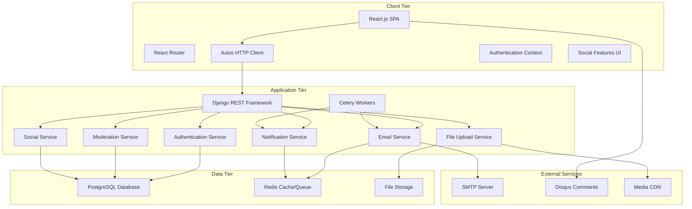

# FinTalk Enhanced Blog Platform

A comprehensive financial blog platform built with React.js frontend, Django REST Framework backend, and PostgreSQL database. This enhanced platform provides user authentication, role-based access control, email subscriptions, content moderation, social features, and multimedia support for creating engaging financial content.

## 🚀 Features

### Core Platform Features
- **User Authentication & Profiles**: Registration, email verification, and detailed user profiles
- **Role-Based Access Control**: Admin, Editor, Writer, Reader, and Guest roles with distinct permissions
- **Content Management**: Rich text editor with draft management and scheduled publishing
- **Social Features**: Follow authors, save articles, and user interactions
- **Email Subscriptions**: Automated notifications for new content and author updates
- **Content Moderation**: Community-driven flagging system with moderator tools
- **Multimedia Support**: Image and video uploads with automatic optimization
- **Commenting System**: Disqus integration for community discussions
- **Responsive Design**: Mobile-first design with full accessibility support

### Technical Features
- **Modern Architecture**: React 18+ with Django 4.2+ and PostgreSQL 15
- **Background Processing**: Celery with Redis for email notifications and scheduled tasks
- **API-First Design**: Comprehensive REST API with full documentation
- **Security**: CORS protection, CSRF tokens, input sanitization, and rate limiting
- **Performance**: Caching, query optimization, and CDN-ready static files
- **Monitoring**: Comprehensive logging and health check endpoints
- **Containerization**: Full Docker support for development and production

## 📚 Documentation

### Quick Links
- **[User Guide](documentation/user-guide.md)** - Complete guide for end users
- **[Admin Guide](documentation/admin-guide.md)** - Administrator and moderation features
- **[Development Guide](documentation/development-guide.md)** - Local development setup
- **[Deployment Guide](documentation/deployment-guide.md)** - AWS EC2 production deployment
- **[API Documentation](documentation/api-documentation.md)** - Complete API reference

### Additional Resources
- **[Testing Guide](documentation/testing-guide.md)** - Testing procedures and guidelines
- **[Docker Guide](documentation/docker-guide.md)** - Docker configuration and usage
- **[Security Guide](documentation/security-guide.md)** - Security configuration and best practices
- **[Accessibility Guide](documentation/accessibility-guide.md)** - Accessibility features and guidelines
- **[Disqus Setup](documentation/disqus-setup.md)** - Comment system configuration

## 🏗️ Architecture Overview

The FinTalk platform follows a modern three-tier architecture with microservices-ready design:



### Technology Stack

**Frontend:**
- React.js 18+ with functional components and hooks
- React Router v6 for client-side routing
- Axios for HTTP requests with interceptors
- React Context for authentication state
- Material-UI components for consistent design
- React Hook Form for complex forms

**Backend:**
- Django 4.2+ with Django REST Framework
- PostgreSQL 15 with optimized queries
- Redis for caching and message broker
- Celery for background task processing
- Django Allauth for authentication
- Pillow for image processing

**Infrastructure:**
- Docker and Docker Compose for containerization
- Nginx for reverse proxy and static files
- Let's Encrypt for SSL certificates
- AWS EC2 for production hosting

## 🚀 Quick Start

### Using Docker (Recommended)

1. **Clone the repository:**
   ```bash
   git clone https://github.com/yourusername/fintalk-enhanced-blog.git
   cd fintalk-enhanced-blog
   ```

2. **Set up environment variables:**
   ```bash
   cp .env.example .env
   # Edit .env file with your configuration if needed
   ```

3. **Start the development environment:**
   ```bash
   docker-compose up --build
   ```

4. **Initialize the database:**
   ```bash
   # Run migrations
   docker-compose exec backend python manage.py migrate
   
   # Create superuser
   docker-compose exec backend python manage.py createsuperuser
   ```

5. **Access the application:**
   - **Frontend**: http://localhost:3000
   - **Backend API**: http://localhost:8000/api/
   - **Django Admin**: http://localhost:8000/admin/

### User Roles and Permissions

- **Guest**: Read articles and browse content
- **Reader**: Save articles, follow authors, subscribe to notifications
- **Writer**: Create, edit, and publish articles
- **Editor**: Moderate content and manage writers
- **Admin**: Full platform access and user management

## 📁 Project Structure

```
fintalk-enhanced-blog/
├── documentation/              # Comprehensive documentation
│   ├── user-guide.md          # End user guide
│   ├── admin-guide.md         # Administrator guide
│   ├── development-guide.md   # Development setup
│   ├── deployment-guide.md    # AWS EC2 deployment
│   ├── api-documentation.md   # API reference
│   └── ...                    # Additional guides
├── frontend/                   # React.js application
│   ├── src/
│   │   ├── components/        # React components
│   │   │   ├── auth/         # Authentication components
│   │   │   ├── posts/        # Post management
│   │   │   ├── social/       # Social features
│   │   │   └── common/       # Shared components
│   │   ├── pages/            # Page components
│   │   ├── services/         # API service layer
│   │   ├── hooks/            # Custom React hooks
│   │   └── utils/            # Utility functions
│   └── package.json          # Dependencies and scripts
├── backend/                    # Django application
│   ├── blog_manager/          # Django project settings
│   ├── accounts/              # User authentication app
│   ├── posts/                 # Blog posts app
│   ├── notifications/         # Email notifications
│   ├── moderation/           # Content moderation
│   ├── common/               # Shared utilities
│   └── requirements.txt      # Python dependencies
├── docker-compose.yml         # Development environment
├── docker-compose.prod.yml    # Production environment
└── .env.example              # Environment template
```

## 🛠️ Development Setup

For detailed development instructions, see the **[Development Guide](documentation/development-guide.md)**.

### Prerequisites
- **Docker & Docker Compose** (recommended)
- **Git** for version control
- **Code Editor** (VS Code recommended)

### Local Development
```bash
# Clone repository
git clone https://github.com/yourusername/fintalk-enhanced-blog.git
cd fintalk-enhanced-blog

# Start development environment
docker-compose up --build

# Initialize database
docker-compose exec backend python manage.py migrate
docker-compose exec backend python manage.py createsuperuser
```

## 🚀 Production Deployment

For complete production deployment instructions, see the **[Deployment Guide](documentation/deployment-guide.md)**.

### AWS EC2 Deployment Summary

1. **Create EC2 Instance** (Ubuntu 22.04 LTS, t3.medium recommended)
2. **Configure Security Groups** (SSH, HTTP, HTTPS)
3. **Install Docker and Docker Compose**
4. **Clone repository and configure environment**
5. **Deploy with production Docker Compose**
6. **Configure SSL with Let's Encrypt**
7. **Set up monitoring and backups**

### Quick Production Commands
```bash
# Deploy production environment
docker-compose -f docker-compose.prod.yml up -d --build

# Initialize production database
docker-compose -f docker-compose.prod.yml exec backend python manage.py migrate
docker-compose -f docker-compose.prod.yml exec backend python manage.py collectstatic --noinput
```

## 🧪 Testing

The platform includes comprehensive testing at all levels:

### Running Tests
```bash
# Backend tests
docker-compose exec backend python -m pytest --cov=. --cov-report=html

# Frontend tests
docker-compose exec frontend npm test

# End-to-end tests
docker-compose exec frontend npm run test:selenium
```

### Test Coverage
- **Backend**: 85%+ unit and integration test coverage
- **Frontend**: Component and integration testing with React Testing Library
- **E2E**: Selenium tests for critical user workflows
- **API**: Comprehensive API endpoint testing

For detailed testing procedures, see the **[Testing Guide](documentation/testing-guide.md)**.

## 🔧 API Reference

The platform provides a comprehensive REST API for all features:

### Key Endpoints
- **Authentication**: `/api/auth/` - User registration, login, profiles
- **Posts**: `/api/posts/` - CRUD operations, drafts, scheduling
- **Social**: `/api/users/{id}/follow/` - Follow users, save articles
- **Moderation**: `/api/moderation/` - Content flagging and review
- **Notifications**: `/api/notifications/` - Email subscriptions

### API Features
- **Session-based authentication** with CSRF protection
- **Role-based permissions** for different user types
- **Comprehensive validation** and error handling
- **Rate limiting** to prevent abuse
- **Pagination** for large datasets

For complete API documentation, see the **[API Documentation](documentation/api-documentation.md)**.

## API Documentation

### Base URL
- Development: `http://localhost:8000`
- Production: `https://yourdomain.com`
## 🔒 Security & Performance

### Security Features
- **Authentication**: Session-based with CSRF protection
- **Authorization**: Role-based access control (RBAC)
- **Input Sanitization**: XSS and SQL injection prevention
- **CORS Protection**: Configured for specific origins
- **Rate Limiting**: API abuse prevention
- **SSL/TLS**: HTTPS enforcement in production

### Performance Optimizations
- **Database**: Query optimization and strategic indexing
- **Caching**: Redis for session storage and API responses
- **CDN Ready**: Optimized static file serving
- **Background Tasks**: Celery for email notifications
- **Code Splitting**: Lazy-loaded React components

For detailed security configuration, see the **[Security Guide](documentation/security-guide.md)**.

## 🤝 Contributing

We welcome contributions to the FinTalk Enhanced Blog Platform! Here's how to get started:

### Development Process

1. **Fork the repository** and clone your fork
2. **Set up development environment** using the [Development Guide](documentation/development-guide.md)
3. **Create a feature branch**: `git checkout -b feature/your-feature-name`
4. **Make your changes** following our coding standards
5. **Write tests** and ensure all tests pass
6. **Submit a pull request** with a clear description

### Code Standards

- **Backend**: Follow PEP 8, use type hints, write comprehensive docstrings
- **Frontend**: Use ESLint configuration, write meaningful component names
- **Testing**: Maintain test coverage above 80%
- **Documentation**: Update documentation for new features

### Reporting Issues

- **Search existing issues** first
- **Use issue templates** when available
- **Provide detailed information**: steps to reproduce, environment details, error messages

## 📄 License

This project is licensed under the MIT License. See the [LICENSE](LICENSE) file for details.

## 🆘 Support

### Getting Help

- **[User Guide](documentation/user-guide.md)** - Complete user documentation
- **[Admin Guide](documentation/admin-guide.md)** - Administrator resources
- **[Development Guide](documentation/development-guide.md)** - Development setup and guidelines
- **[GitHub Issues](https://github.com/yourusername/fintalk-enhanced-blog/issues)** - Bug reports and feature requests
- **[GitHub Discussions](https://github.com/yourusername/fintalk-enhanced-blog/discussions)** - Community discussions

### Quick Links

- **Live Demo**: [https://demo.fintalk.com](https://demo.fintalk.com)
- **API Documentation**: [https://api.fintalk.com/docs](https://api.fintalk.com/docs)
- **Status Page**: [https://status.fintalk.com](https://status.fintalk.com)

---

**Built with ❤️ for the financial community**

*Transform your financial insights into engaging content with FinTalk Enhanced Blog Platform*